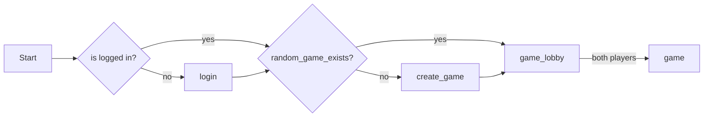
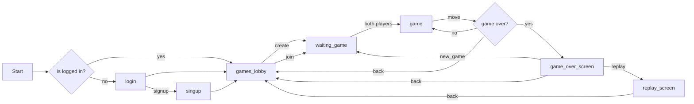

# battlechess_godot

## quickstart a game

## production flow

# TODOs

## Now
- [ ] Auto login + logout
- [ ] Android UI adaptations

## Next
- [ ] aesthetics
- [ ] test slow connections

## Later
- [ ] Avatars
- [ ] Sounds
- [ ] Animations
- [ ] [Save encrypted](https://docs.huihoo.com/godotengine/godot-docs/godot/tutorials/engine/encrypting_save_games.html), especially password
- [ ] signal error on all classes / on singleton + Node that captures erreors and shows on screen
- [ ] Server Send events.

[See theory](https://www.pubnub.com/guides/server-sent-events/).

[fastapi sse](https://sysid.github.io/server-sent-events/).

[old SSE Godot client](https://github.com/WolfgangSenff/HTTPSSEClient/tree/master) but looks like
it should be [easy to implement with HTTPClient](https://github.com/godotengine/godot/issues/26238#issuecomment-466819999)

## Done

- [x] Create a scene for "waiting game to start"
- [x] Add back button on game or show menu/game list to go to lobby
- [x] Create game button
- [x] Add a refresh game list button
- [x] Add replay game scene
- [x] Taken (e.g. via flex box of textureatlas instances)
- [x] Remove full games not owned by player from list
- [x] Add show/hide finished games button
- [x] Apk
- [x] Settings on main page : server
- [x] Refresh animation
