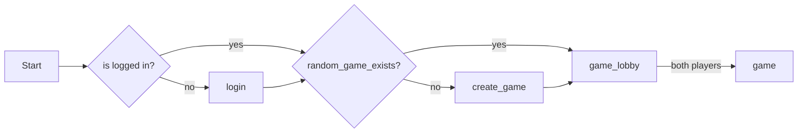
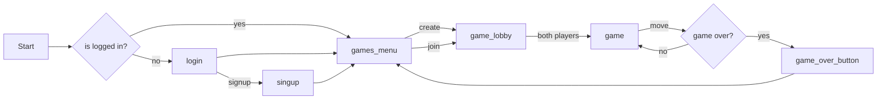

# battlechess_godot

## quickstart a game

## production flow

# TODOs

## Now
[ ] Create a scene for "waiting game to start"

It's better to switch to main_btch scene when everything is ready to start, otherwise spaghetti

[ ] Remove full games not owned by player from list
[ ] Add show/hide finished games button
[ ] Add back button on game or show menu/game list to go to lobby
[ ] Create game button

## Next
[ ] Taken (e.g. via flex box of textureatlas instances)
[ ] Add replay game scene
[ ] Create game scene
[ ] signal error on all classes / on singleton + Node that captures erreors and shows on screen

## Later
[ ] Server Send events.

[See theory](https://www.pubnub.com/guides/server-sent-events/).

[fastapi sse](https://sysid.github.io/server-sent-events/).

[old SSE Godot client](https://github.com/WolfgangSenff/HTTPSSEClient/tree/master) but looks like
it should be [easy to implement with HTTPClient](https://github.com/godotengine/godot/issues/26238#issuecomment-466819999)

## Done
