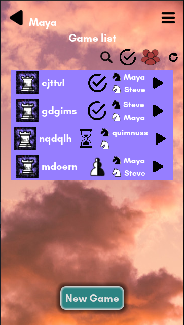
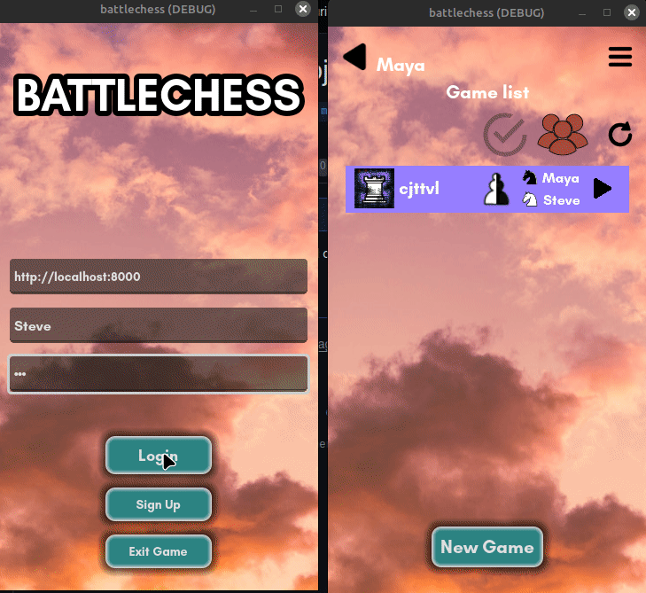
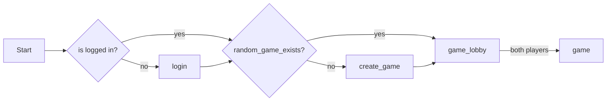
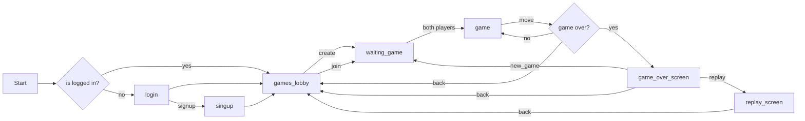

# battlechess: The Godot Client

## How to play

To play go to the release pages! Download the apk or the linux version and let's go!

Tell a friend to join you, Sign Up a new user, create a game and play against each other.

Due to the nature of battlechess, writing an AI for it is quite hard, so you'll need a human to play!

# Development

## UX/UI flow

### quickstart a game

### production flow

# TODOs

## Now
- [ ] [Bug Hunting](https://github.com/quimnuss/battlechess_godot/issues)
- [ ] signal error on all classes / on singleton + Node that captures erreors and shows on screen. Implemented on NavigationLayer an _on_error, redirect all errors there

## Next
- [ ] better aesthetics
- [ ] test slow connections
- [ ] Sounds

## Later
- [ ] gotm.io and itch.io need https server
[Tutorial](https://www.digitalocean.com/community/tutorials/how-to-secure-nginx-with-let-s-encrypt-on-ubuntu-20-04)
OVH has certbot [out-of-the-box](https://help.ovhcloud.com/csm/en-gb-web-hosting-activate-https-website-ssl?id=kb_article_view&sysparm_article=KB0053129)
- [ ] [Host web battlechess](https://gist.github.com/nisovin/cf9dd74678641fb70902866c79692b17)
- [ ] intead of camera rotate, change coordinates
- [ ] pawn promotion choice UI
- [ ] Avatars
- [ ] Animations
- [ ] [Save encrypted](https://docs.huihoo.com/godotengine/godot-docs/godot/tutorials/engine/encrypting_save_games.html), especially password

## Done
- [x] ~Server Send events.~ long polling is a better solution for our use-case
- [x] Android UI adaptations (particulary soft keyboard popup)
- [x] use filter to filter name as well
- [x] Auto login + logout
- [x] Refresh animation
- [x] Settings on main page : server
- [x] Apk
- [x] Add show/hide finished games button
- [x] Remove full games not owned by player from list
- [x] Taken (e.g. via flex box of textureatlas instances)
- [x] Add replay game scene
- [x] Add a refresh game list button
- [x] Create game button
- [x] Add back button on game or show menu/game list to go to lobby
- [x] Create a scene for "waiting game to start"
