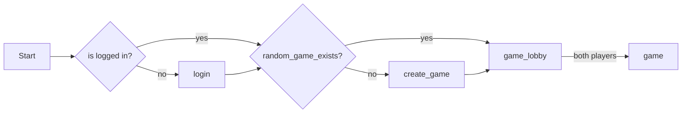
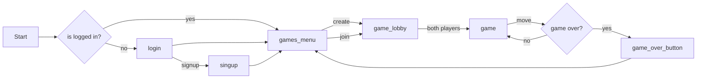

# battlechess_godot

## quickstart a game

## production flow

# TODOs

[ ] Remove full games not owned by player from list
[ ] Add show/hide finished games button
[ ] Add replay game scene
[ ] Add back button on game or show menu/game list to go to lobby
